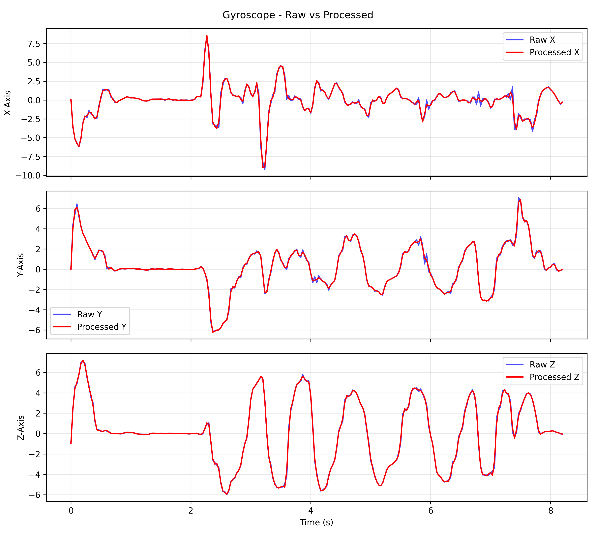
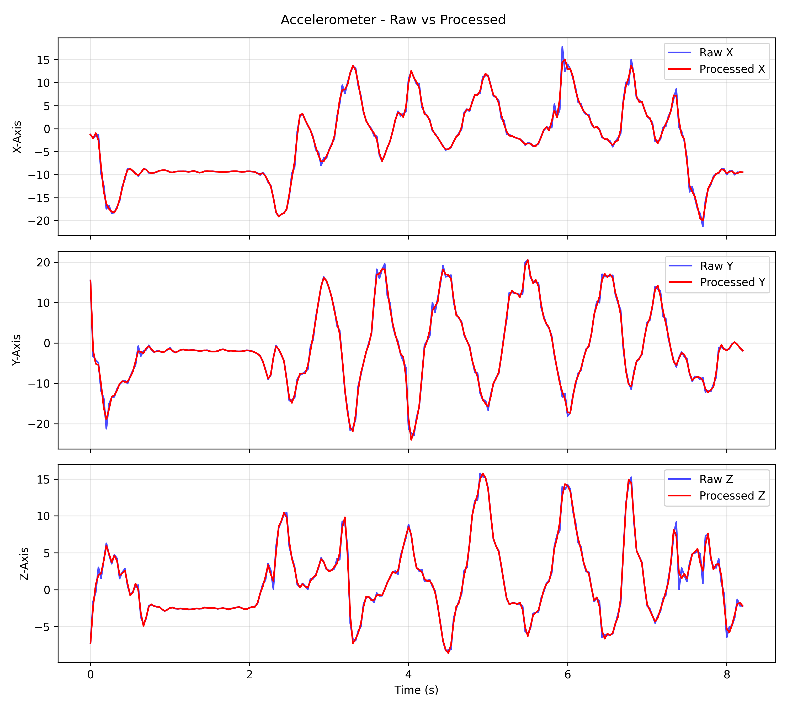

---
# Implementation Details

## Data Preprocessing and Sensor Alignment

One main challenge in the SmartFallMM dataset is variable sampling rates. We address this via:

### Timestamp Extraction and Normalization

All sensor streams are converted to a common base (e.g., seconds from epoch). Skeleton data at 30 fps is assigned synthetic timestamps:

$$
t_{skel}[i] = \frac{i}{30.0}, \quad i \in [0, n_{frames}).
$$

### Ensuring Monotonicity

Occasional timestamp irregularities are removed so timestamps strictly increase:

$$
t_{valid}[i] < t_{valid}[i+1] \quad \forall i.
$$

### Resampling to Fixed Rate

We interpolate each sensor stream to a fixed rate (e.g., 30 Hz) using `interp1d` functions and clip out-of-range data.

### Multi-sensor Alignment

We find the common intersection time and resample each sensor to that domain. Afterwards, a low-pass Butterworth filter (cutoff 5 Hz) may be applied for denoising.

  
*Figure: Gyroscope before and after alignment/resampling. (Placeholder figure)*

  
*Figure: Watch sensor before vs. after DTW alignment. (Placeholder figure)*

  
*Figure: Accelerometer raw vs. processed (S29A07T03). (Placeholder figure)*

  
*Figure: Comparison after aligning accelerometer and gyroscope data (before DTW) vs. after DTW. (Placeholder figure)*

---

## Madgwick Filter Implementation

Below is the pseudo-code for our Madgwick update:

```algorithm
Madgwick Filter Update

Input: q, a, g, dt, β
1. Normalize:      ˆa = a / ||a||
2. Compute gradient: ∇f based on current q and ˆa
3. q_gyro = 0.5 × q ⊗ [0, g_x, g_y, g_z]
4. ẏq = q_gyro − β (∇f / ||∇f||)
5. q_new = q + ẏq × dt
6. q_new = q_new / ||q_new||
Return: q_new
Extended Kalman Filter Implementation
The EKF steps:

EKF Update Step

Input: state x, covariance P, measurements (a, g)
1. Extract q, b from x
2. g_corr = g − b
3. Predict: x⁻ = f(x, g_corr) using quaternion kinematics
4. Compute Jacobian: F = ∂f/∂x
5. P⁻ = F * P * Fᵀ + Q
6. Measurement model: z = h(x), where h(·) maps q to gravity direction
7. Innovation: y = a − h(x⁻)
8. Jacobian of measurement: H = ∂h/∂x
9. S = H * P⁻ * Hᵀ + R
10. K = P⁻ * Hᵀ * S⁻¹
11. x = x⁻ + K * y
12. P = (I − K * H) * P⁻
13. Normalize the q portion of x
Return: (x, P)
Windowing and Feature Extraction
After orientation estimation, data is segmented into windows for classification. A standard sliding window or an adaptive event-centric window (centered on peaks in acceleration) is used.

Fixed-Size Windowing

Input: data, window_size, overlap
1. stride = window_size × (1 − overlap)
2. start indices = [0, stride, 2 × stride, …]
3. For each start index:
   - window = data[start : start + window_size]
Return: array of windows
